# DESARROLLO DE UN BACKEND CON NODE JS Y EXPRESS

## Objetivo

Crear un backend utilizando Node.js y Express para un juego simple. Implementar operaciones CRUD (Crear, Leer, Actualizar y Eliminar) para gestionar los datos del juego. Además, se debe incluir un middleware para manejar errores y utilizar Postman para probar las rutas.

## Indicaciones

Desarrolla un backend utilizando Node.js y Express para un juego simple. Debe incluir operaciones CRUD para gestionar los datos del juego. Utiliza un middleware para manejar errores y Postman para probar las rutas.

---

### `POST /game`

Crea un nuevo juego. Se espera un cuerpo JSON con los datos del juego.

- **Status Code esperado:** `201 – Created`

**JSON de Entrada**
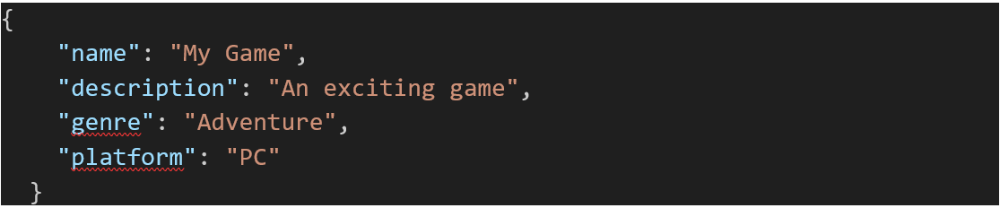

**JSON de Salida (Ejemplo):**
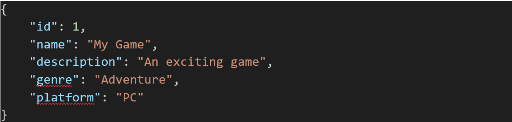

**RESULTADO:**
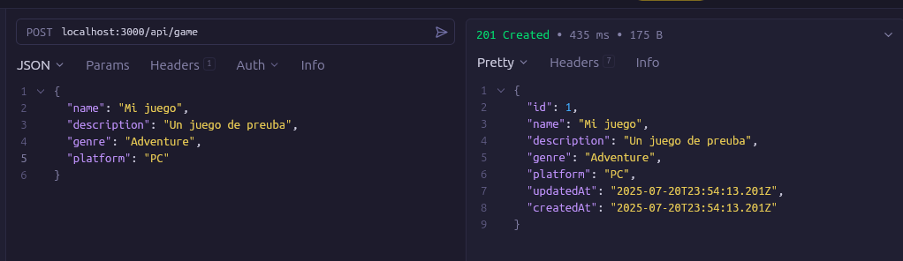
---

### `GET /game/:id`

Obtiene los detalles de un juego específico por su ID.

- **Status Code esperado:** `200 - OK`

**JSON de Salida (Ejemplo):**
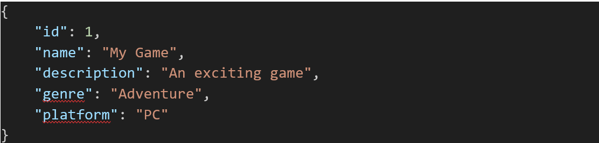

**RESULTADO:**
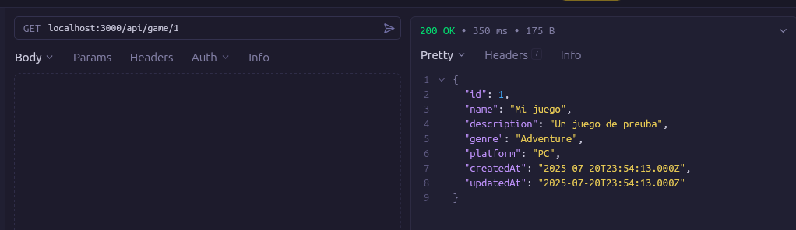
---

### `PUT /game/:id`

Actualiza los datos de un juego existente por su ID. Se espera un cuerpo JSON con los nuevos datos del juego.

- **Status Code esperado:** `200 – OK`

**JSON de Entrada:**
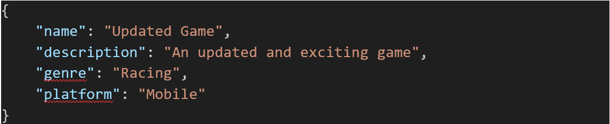

**JSON de Salida (Ejemplo):**
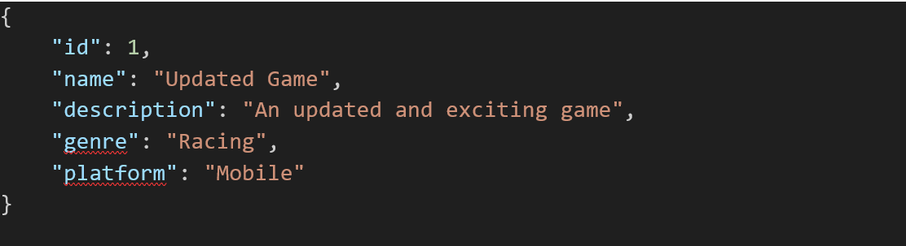

**RESULTADO:**

---

### `DELETE /game/:id`

Elimina un juego específico por su ID.

- **Status Code esperado:** `204 - No Content`

No se espera JSON de salida.

**RESULTADO:**
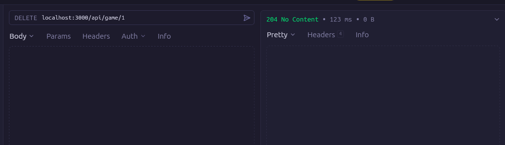

---

### `PATCH /game/:id`

Actualiza parcialmente los datos de un juego por su ID. Se espera un cuerpo JSON con los campos a actualizar.

- **Status Code esperado:** `200 - OK`

**JSON de Entrada:**
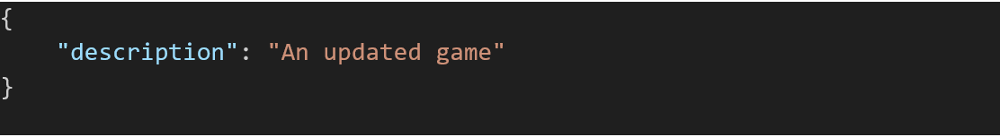

**JSON de lectura después de patch:**
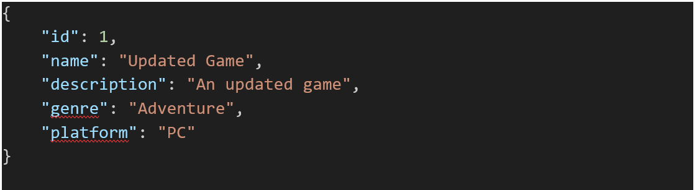

**RESULTADO:**
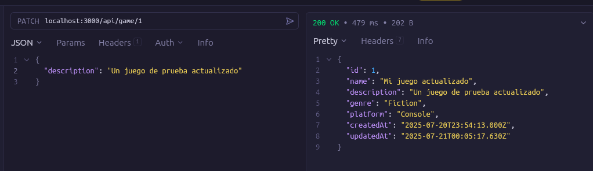

---

## Middleware

- Implementa un middleware para manejar errores en caso de que ocurra algún problema durante la ejecución de las rutas.

hice 2 middlewares, uno para manejar errores y otro para validar los datos de entrada.

[Middlewares](../../src/middleware)

## Base de datos

- Utiliza una base de datos documental o relacional para almacenar la información del juego. Puedes utilizar un ORM (Object-Relational Mapping) como Sequelize para facilitar el manejo de la base de datos.

Realice una base de datos relacional utilizando Sequelize y conectandome a una base de datos MySQL.